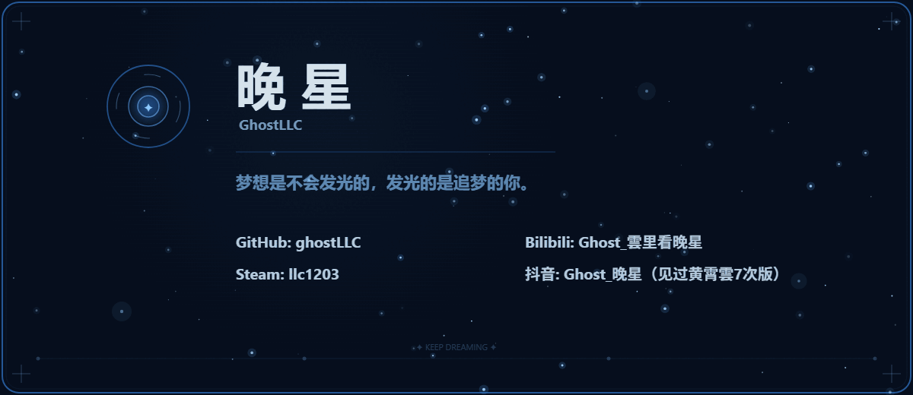

  

  

---

### 👨‍💻 关于我

- 🎓 **华南农业大学** 在读
- 💻 热爱代码、游戏与创作
- 🎮 Steam 库存永远在增长，通关的永远只有那几个
- 🎬 B站 & 抖音业余 UP 主
- 🎵 看过黄霄雲现场 7 次
- 🌐 个人网站: [ghostllc04.vercel.app](https://ghostllc04.vercel.app)

### 🛠 工具箱

### 📊 Stats

  
  

---

  <i>梦想是不会发光的，发光的是追梦的你。</i>

